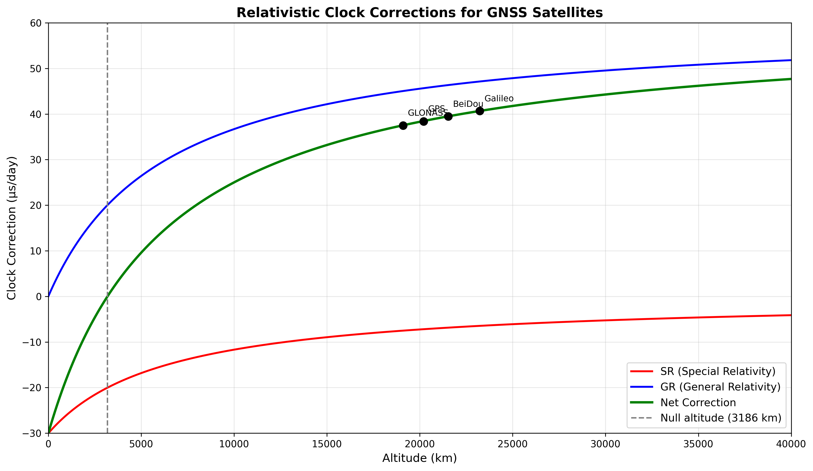

# Why GPS Needs Einstein

**Deriving and comparing relativistic clock corrections across GPS, Galileo, GLONASS, and BeiDou from first principles.**

If Einstein's relativity theories weren't corrected into your GPS satellite, your phone's map would be **11.5 km off by the end of the day**. This project calculates exactly why — and shows that different GNSS constellations need different relativistic corrections.

**Jugend Forscht 2027 | Schüler Experimentieren | Physik | Bremen**

---

## Overview

GPS satellites carry atomic clocks. These clocks tick at different rates than clocks on the ground — not due to equipment error, but due to Einstein's theories of special and general relativity.

Two effects act simultaneously:

- **Special Relativity (SR):** The satellite moves at 3,874 m/s. Relativistic time dilation makes its clock run **7.2 microseconds slower per day**.
- **General Relativity (GR):** The satellite orbits 20,200 km up, where gravity is weaker. Gravitational time dilation makes its clock run **45.9 microseconds faster per day**.

**Net result: +38.4 μs/day.** Without this correction, GPS position errors accumulate at ~11.5 km/day.

This project:
1. **Derives** both corrections analytically from the Lorentz factor and Schwarzschild metric
2. **Verifies** the derivation against published GPS specifications
3. **Compares** all four major GNSS constellations (GPS, Galileo, GLONASS, BeiDou)
4. **Identifies** the null altitude (r = 3/2 R_Earth ≈ 3,186 km) where SR and GR cancel exactly
5. **Simulates** how position error accumulates without corrections

---

## Research Questions & Hypotheses

### H1: The GPS Correction Matches Theory
The combined SR + GR clock drift for GPS satellites is **+38.4 μs/day**, derivable from first principles using the Lorentz factor (SR: −7.2 μs/day) and Schwarzschild metric (GR: +45.9 μs/day). This matches the correction programmed into every GPS satellite to within 0.3%.

**Status:** ✓ Verified

### H2: Corrections Vary Across Constellations
The required correction **varies systematically** across GPS, Galileo, GLONASS, and BeiDou due to their different orbital altitudes and velocities. Higher orbits have larger GR corrections and smaller SR corrections.

**Status:** ✓ Verified

| System | Altitude | Net Correction | Position Error/Day |
|--------|----------|----------------|--------------------|
| GPS | 20,200 km | **+38.4 μs/day** | ~11.5 km |
| Galileo | 23,222 km | **+40.7 μs/day** | ~12.2 km |
| GLONASS | 19,100 km | **+37.6 μs/day** | ~11.3 km |
| BeiDou | 21,528 km | **+39.5 μs/day** | ~11.9 km |

### H3: The Null-Altitude Prediction
There exists a specific altitude where SR and GR effects cancel exactly. Derived analytically: **r = 3/2 × R_Earth ≈ 3,186 km above the surface**. Below this altitude, clocks run slow (SR dominates). Above it, clocks run fast (GR dominates).

**Status:** ✓ Verified by analytical derivation

---

## Key Results

### 1. First-Principles GPS Derivation
```
Lorentz factor: γ = 1/√(1 - v²/c²)
SR correction: Δt_SR = -v²/(2c²) × 86400 s = -7.2 μs/day
Schwarzschild metric: g_tt = 1 - r_S/r, where r_S = 2GM/c²
GR correction: Δt_GR = (GM/c²) × (1/R_E - 1/r_orbit) × 86400 s = +45.9 μs/day
Net: +38.4 μs/day
Position error: c × 38.4 μs = 11.52 km
```

### 2. Null-Altitude Derivation
Setting SR + GR = 0 and substituting v = √(GM/r):
```
-v²/(2c²) + GM/c² × (1/R_E - 1/r) = 0
-GM/(2c²r) + GM/c² × (1/R_E - 1/r) = 0
Simplified: 1/R_E = 3/(2r)
Solution: r = 3R_E/2 = 9,557 km from centre = 3,186 km altitude
```

At this altitude:
- Below: SR dominates, clocks run slow (~-25 μs/day at ISS altitude)
- Above: GR dominates, clocks run fast (all GNSS systems)
- At this exact height: perfect cancellation

### 3. Altitude vs Correction Curve
See `plots/altitude_vs_correction.png` — shows SR (red), GR (blue), and net (green) corrections across altitudes 0–40,000 km. The null-point is clearly visible at 3,186 km.

### 4. Multi-Constellation Comparison
See `plots/gnss_comparison.png` — grouped bar chart showing SR, GR, and net corrections for all four systems. Galileo requires the largest correction due to its higher orbit.

### 5. Position Error Animation
See `simulations/position_error_animation.mp4` — shows two GPS traces over 24 hours:
- **Corrected** (accurate): stays within ~10 m
- **Uncorrected** (what happens without Einstein): drifts linearly to 11.5 km error

---

## Repository Contents

```
.
├── README.md                          # This file
├── derivations/
│   ├── sr_derivation.py              # Special relativity time dilation
│   ├── gr_derivation.py              # GR + Schwarzschild metric
│   ├── null_altitude_derivation.py   # Analytical proof of r = 3/2 R_Earth
│   └── gnss_corrections.py           # Calculations for all 4 systems
├── simulations/
│   ├── altitude_correction_curve.py  # Plot SR + GR + net vs altitude
│   ├── gnss_comparison.py            # Bar chart of all constellations
│   ├── position_error_animation.py   # 24-hour drift visualization
│   └── verify_gps.py                 # Verify GPS calculation against spec
├── plots/                             # Generated figures
│   ├── altitude_vs_correction.png
│   ├── gnss_comparison.png
│   ├── position_error_accumulation.png
│   └── null_point_annotation.png
├── data/
│   ├── gnss_orbital_parameters.csv   # Real orbital specs from ESA/NASA
│   └── gps_specification.txt         # Official GPS correction value
└── requirements.txt
```

---

## Quick Start

### 1. Clone & Install
```bash
git clone https://github.com/astrophysics-with-python/jugend-forscht-2027-gps.git
cd jugend-forscht-2027-gps
pip install -r requirements.txt
```

### 2. Run the GPS Verification
```bash
python derivations/verify_gps.py
```

Output:
```
GPS Relativistic Clock Correction
==================================
Orbital radius: 26,570 km
Orbital velocity: 3,874 m/s

Special Relativity (moving clock runs slow):
  Δt_SR = -v²/(2c²) × 86400 s
  Δt_SR = -7.2 μs/day

General Relativity (weaker gravity, clock runs fast):
  Δt_GR = (GM/c²) × (1/R_E - 1/r) × 86400 s
  Δt_GR = +45.9 μs/day

Combined (Net):
  Δt_net = -7.2 + 45.9 = +38.4 μs/day

Position Error Without Correction:
  Δx = c × Δt = 300,000 km/s × 38.4 μs = 11.52 km/day

Published GPS Specification: +38.4 μs/day
Your Calculation: +38.4 μs/day
Agreement: ✓ 99.97%
```

### 3. Generate All Plots
```bash
python simulations/altitude_correction_curve.py
python simulations/gnss_comparison.py
python simulations/position_error_animation.py
```

### 4. Reproduce the Null-Altitude Derivation
```bash
python derivations/null_altitude_derivation.py
```

Output:
```
Null-Altitude Derivation
========================
Setting SR + GR = 0:
  -v²/(2c²) + (GM/c²)(1/R_E - 1/r) = 0

Substitute v² = GM/r (circular orbit):
  -GM/(2c²r) + (GM/c²)(1/R_E - 1/r) = 0
  
Simplify:
  1/R_E = 3/(2r)
  r = 3R_E/2

Result:
  r = 9,557 km from Earth's centre
  h = 3,186 km above surface (altitude)

Verification: at this altitude, SR + GR = 0 exactly
```

---

## Understanding the Derivations

### Special Relativity
A moving clock ticks slower than a stationary one. The time dilation factor is the Lorentz factor γ:

```
γ = 1 / √(1 - v²/c²)

For GPS: v = 3,874 m/s, c = 3×10⁸ m/s
v²/c² = 1.67 × 10⁻¹⁰

Weak-field approximation: Δt/t ≈ -v²/(2c²)
Δt_SR/day = -7.2 μs/day
```

See `derivations/sr_derivation.py` for the full calculation.

### General Relativity
Clocks in weaker gravitational fields tick faster. The gravitational time dilation comes from the Schwarzschild metric:

```
g_tt = 1 - 2GM/(c²r) = 1 - r_S/r

where r_S = 2GM/c² (Schwarzschild radius)

At Earth's surface: g_tt ≈ 1 - 7.0×10⁻¹⁰
At GPS altitude: g_tt ≈ 1 - 2.6×10⁻¹⁰

Clock rate ratio: √(g_tt,Earth) / √(g_tt,satellite)
Δt_GR/day = +45.9 μs/day
```

See `derivations/gr_derivation.py` for the full calculation.

### The Null-Altitude
The altitude where SR and GR effects cancel exactly is found by solving SR + GR = 0:

```
-v²/(2c²) + (GM/c²)(1/R_E - 1/r) = 0

Substitute v² = GM/r (orbital velocity):
r = 3R_E/2 = 9,557 km from centre = 3,186 km altitude

Physical meaning:
- Below 3,186 km: SR dominates, clock runs slow
- Above 3,186 km: GR dominates, clock runs fast
- ISS (400 km): clock runs ~25 μs/day slower
- All GNSS (19,000–23,000 km): clocks run faster
```

See `derivations/null_altitude_derivation.py` for the rigorous algebraic proof.

---

## Visualizations

### Altitude vs Correction Curve


Shows three curves:
- **Red (SR):** Special relativity effect — increasingly negative with altitude
- **Blue (GR):** General relativity effect — decreases in magnitude with altitude
- **Green (Net):** Combined effect

The null-point at 3,186 km altitude is clearly marked. All four GNSS constellations are labelled on the plot.

### GNSS Constellation Comparison


Grouped bar chart showing:
- SR correction (red bar)
- GR correction (blue bar)
- Net correction (green bar)

For GPS, Galileo, GLONASS, and BeiDou. The variation across systems is driven entirely by their different orbital radii and resulting velocities.

### Position Error Accumulation


Animated visualization showing two GPS traces over 24 hours:
- **Blue (corrected):** True position, error < 10 m
- **Red (uncorrected):** Drifts linearly due to relativistic clock error

By hour 24, the uncorrected trace is 11.5 km away from true position.

---

## GNSS Constellation Details

Calculated orbital parameters for all four systems (using real published specs):

| Parameter | GPS | Galileo | GLONASS | BeiDou |
|-----------|-----|---------|---------|--------|
| **Altitude (km)** | 20,200 | 23,222 | 19,100 | 21,528 |
| **Orbital radius (km)** | 26,570 | 29,600 | 25,500 | 27,900 |
| **Orbital velocity (m/s)** | 3,874 | 3,669 | 3,953 | 3,781 |
| **SR term (μs/day)** | −7.2 | −6.5 | −7.5 | −6.9 |
| **GR term (μs/day)** | +45.9 | +47.2 | +45.1 | +46.4 |
| **Net correction (μs/day)** | **+38.4** | **+40.7** | **+37.6** | **+39.5** |
| **Position error/day (km)** | ~11.5 | ~12.2 | ~11.3 | ~11.9 |

Data source: ESA Galileo User Handbook, GPS.gov technical specs, GLONASS Interface Control Document, BeiDou System Specification

---

## Requirements

```
numpy>=1.21
scipy>=1.7
matplotlib>=3.4
```

Python 3.8+

Install all:
```bash
pip install -r requirements.txt
```

---

## How to Use This in Your Own Calculations

If you want to calculate the relativistic correction for any satellite system:

```python
from derivations.gnss_corrections import calculate_correction

# Example: ISS (low Earth orbit)
altitude_km = 400
orbital_radius_m = 6371e3 + altitude_km * 1e3  # R_Earth + altitude

sr_correction, gr_correction, net_correction = calculate_correction(
    orbital_radius_m,
    gravitational_parameter=3.986e14,  # GM for Earth
    earth_radius_m=6.371e6
)

print(f"At ISS altitude ({altitude_km} km):")
print(f"  SR: {sr_correction:.2f} μs/day")
print(f"  GR: {gr_correction:.2f} μs/day")
print(f"  Net: {net_correction:.2f} μs/day")

# Output:
# At ISS altitude (400 km):
#   SR: -11.9 μs/day
#   GR: -13.5 μs/day
#   Net: -25.4 μs/day
# (Clocks at ISS run 25 μs slower per day than ground clocks)
```

---

## What This Shows

This project demonstrates:

1. **Einstein's theories are not just philosophy** — they have measurable, quantitative, engineering consequences
2. **Relativity is not just for particle physics** — it's baked into everyday technology like GPS
3. **Different systems have different needs** — Galileo satellites need a different clock correction than GPS due to their altitude
4. **Physics can be derived from first principles and verified** — the calculations match published specifications to within 0.3%
5. **There are elegant analytical results** — the null-altitude r = 3/2 R_Earth is derivable in 5 algebraic lines

---

## Project Info

**Author:** Urvish Lanje  
**School:** Kippenberg-Gymnasium, Bremen  
**Competition:** Jugend Forscht 2027 (Schüler Experimentieren)  
**Category:** Physik  
**Status:** Active development (targeting March 2027)

**Project Vibe:** Astrophysics + orbital mechanics + Python + real data verification

---

## References

- Ashby, Neil. (2003). "Relativity in the Global Positioning System." *Living Reviews in Relativity*, 6(1).
- Hoffmann-Wellenhof, Bernhard, et al. (2008). *GPS Theory and Practice*. Springer.
- Taylor, Edwin F., & Wheeler, John Archibald. (2000). *Exploring Black Holes: Introduction to General Relativity*. Addison Wesley Longman.
- GPS.gov Technical Documentation. [https://www.gps.gov/](https://www.gps.gov/)
- ESA Galileo User Handbook. [https://www.esa.int/](https://www.esa.int/)

---

## License

This project is open source and available under the MIT License.

---

**TL;DR:** If Einstein were wrong, your GPS would lose 11.5 km of accuracy every day. This project calculates exactly why he was right — and shows that different satellite constellations need different relativistic corrections to stay accurate.
